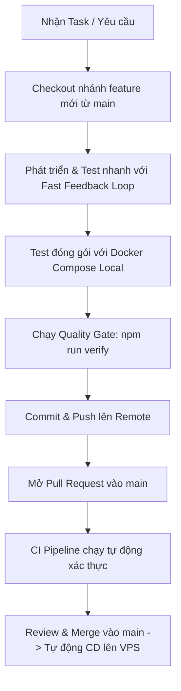

# Developer Runbook: Quy Trình Phát Triển Trên Nhánh Feature

Tài liệu hướng dẫn quy trình làm việc chuẩn (Standard Operating Procedure) từ lúc nhận task, dev & test tại local (với cả Node local và Docker Compose) cho tới khi mở Pull Request lên `main`.

---

## 1. Vòng đời phát triển một Feature (Workflow Lifecycle)



---

## 2. Các bước thực hiện chi tiết

### Bước 1: Khởi tạo nhánh Feature từ `main` mới nhất
```bash
git checkout main
git pull origin main
git checkout -b feat/ten-tinh-nang-moi
```
*(Quy ước đặt tên nhánh: `feat/...`, `fix/...`, `refactor/...`, `chore/...`)*

---

### Bước 2: Chuẩn bị môi trường Local
Đảm bảo file cấu hình môi trường `.env` đã được tạo từ mẫu:
```bash
cp .env.example .env
```

---

### Bước 3: Phát triển & Kiểm thử tại Local (2 Chế độ)

#### 👉 Chế độ A: Fast Loop (Chạy trực tiếp bằng Node.js máy host - Khuyên dùng khi code)
- **Ưu điểm:** Khởi động tức thì, feedback loop dưới 1 giây.
```bash
# 1. Cài đặt dependencies (nếu có cập nhật package.json)
npm install

# 2. Chạy server ở chế độ watch (hot-reload tự restart khi sửa code src/)
npm run dev

# 3. Chạy test suite
npm run test
```

#### 👉 Chế độ B: Docker Parity Loop (Chạy qua Docker Compose)

##### 1. Chế độ Hot-Reload trong Container (Dev Mode):
Kích hoạt override configuration:
```bash
cp compose.override.yaml.example compose.override.yaml
docker compose up
```
*Lúc này, các thay đổi trong thư mục `src/` trên máy bạn sẽ lập tức kích hoạt `tsx watch` reload lại server bên trong container mà không cần build lại image.*

##### 2. Chế độ Test Image Production (Production Parity Test):
Dùng để kiểm tra chính xác image chuẩn production trước khi commit:
```bash
# Tạm thời bỏ qua override để test đúng image production:
docker compose -f compose.yaml up --build
```
Kiểm tra endpoint:
- Web App: `http://localhost:3000` (hoặc cổng được set ở `FORWARD_PORT`)
- Healthcheck: `http://localhost:3000/health`

---

### Bước 4: Quality Gate trước khi Commit (Verification Gate)
Luôn chạy lệnh này ở máy local trước khi tạo commit:
```bash
npm run verify
```
*Lệnh này sẽ thực hiện compile TypeScript (`tsc`) và chạy toàn bộ unit/integration test suite.*

---

### Bước 5: Commit & Đẩy lên Remote
Tuân thủ Conventional Commits:
```bash
git add .
git commit -m "feat(wiki): them tinh nang tim kiem bai viet"
git push origin feat/ten-tinh-nang-moi
```

---

### Bước 6: Tạo Pull Request (PR) & CI Validation
1. Truy cập GitHub repository và mở **Pull Request** từ nhánh feature của bạn vào `main`.
2. Quan sát **GitHub Actions**:
   - Job `test` (`npm run verify`) sẽ tự động kích hoạt để kiểm tra tính toàn vẹn của code.
   - Job `build-and-publish` và `deploy` **sẽ không chạy** trên nhánh feature (được bảo vệ chỉ chạy khi merge vào `main`).
3. Sau khi đồng nghiệp review và CI báo xanh (Pass), tiến hành **Squash & Merge** hoặc **Merge PR**.
4. GitHub Actions trên `main` sẽ tự động đóng gói image gắn tag SHA và deploy lên VPS thông qua SSH.
